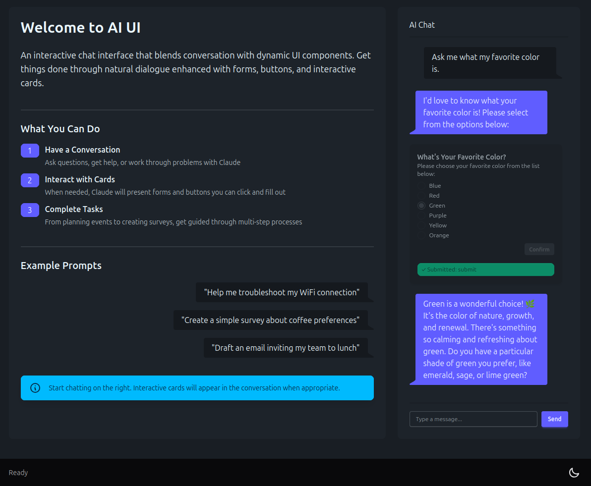

# AI UI - Interactive Chat Interface with Claude

An simple AI Chat interface with a trick up it's sleeve. Built with Quart and the Claude Agent SDK. Enhanced with a skill that allows the AI to generate in-line 'cards' powered by DaisyUI.

## Installation & Usage
Install and Run:
```
export ANTHROPIC_API_KEY=your_api_key_here
uv sync
uv run app.py
# Navigate to `http://localhost:5000`
```

Reset session with:
```
curl -X POST http://127.0.0.1:5000/api/reset_session -H "content_type:application/json"
```

## Screenshots

### Example:

